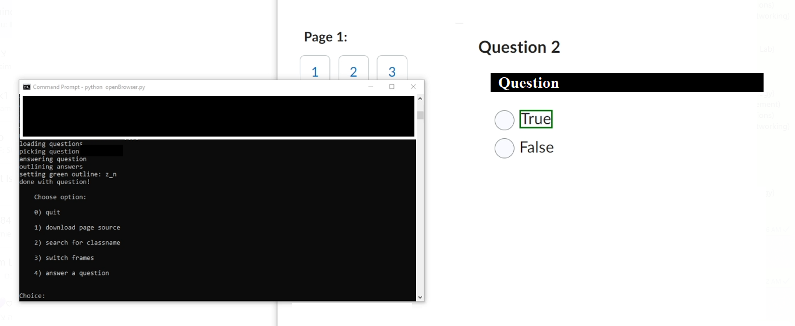

# Chat2L
Connects the OpenAI API to the Desire2Learn platform, allowing you to quickly search for answers.

Read more here: https://icantsec.com/?p=37

Usage:
-Run the browser_handler.py file
-This will have selenium open Chrome, at which point you can navigate to your test on D2L
-Once the test is started, you will want to use the menu to "Switch frames", in order to allow selenium access to the HTML blocks it needs
-After this, you can choose the menu option for it to answer questions, at which point it will load the questions/answers on the page
-Finally, enter the question number, and (after thinking for a little bit) it will outline the correct answer choice(s)

Note - It will load the questions/answers each time, because some tests switch pages for each question.

Feel free to send any questions, comments, or concerns

Preview:

